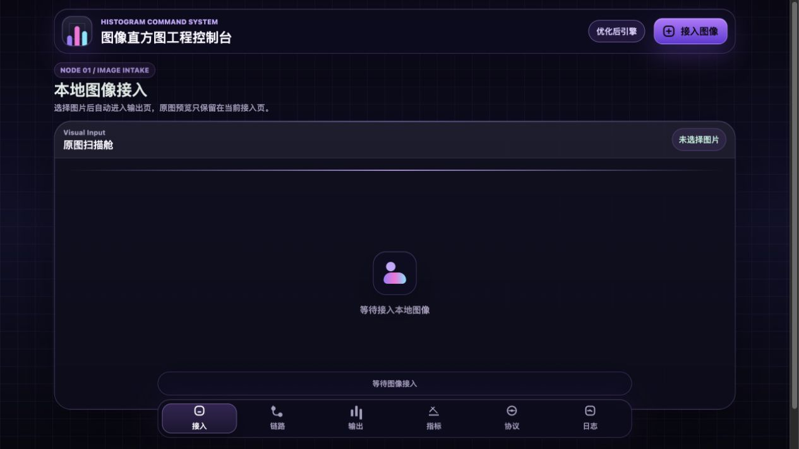
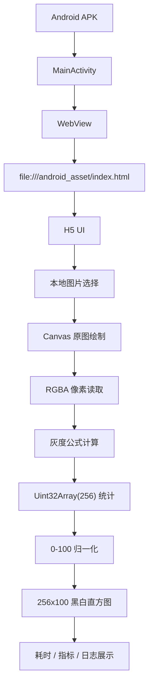

# Mobile Histogram Analyzer

移动端图像直方图分析系统。一个面向软件开发实践课程交付的 **Android WebView APK + H5 Canvas** 离线图像处理应用。

项目选择课程课题 **“图像直方图计算及性能优化”**，目标是在手机本地选择图片、预览图片、计算灰度直方图、绘制 `256x100` 黑白输出，并展示完整生成耗时。核心算法严格使用：

```text
gray = red * 0.299 + green * 0.587 + blue * 0.114
```



> 当前 `dist/` 已重新输出两份可并装 debug APK，包含最新 UI、图标角标、loading、架构图和 Histogram Compare 收口。

## 30 秒说清楚

| 维度 | 当前实现 |
| --- | --- |
| 产品形态 | Android APK，WebView 加载本地 H5 页面 |
| 核心技术 | Android WebView、Java、HTML5、CSS、JavaScript、Canvas |
| 输入方式 | 手机本地图片选择，`image/*` 文件入口 |
| 输出结果 | `256` 个灰度 bins，归一化到 `0-100`，绘制 `256x100` 黑白直方图 |
| 性能目标 | 显示生成耗时，课程目标为尽量低于 `300ms` |
| 离线能力 | APK 内置 assets，无后端、无数据库、无网络依赖 |
| 产品观感 | 黑紫控制台视觉、统一图标、自然 loading、答辩友好分屏 |
| 对照交付 | 优化前 / 优化后两份可并装 debug APK，用于性能答辩对比 |

## 项目亮点

- **课程要求对齐**：围绕移动端、图片输入、灰度统计、`256x100` 输出、耗时展示和 APK 交付展开，不扩展无关后台系统。
- **真实移动端闭环**：Android 原生层负责 WebView、文件选择和系统图片保存，H5 层负责 Canvas 图像处理。
- **算法可验证**：灰度公式、256 bin 总数、`0-100` 归一化和绘制规则都有脚本化 fixture 检查。
- **性能可讲清**：保留低效 baseline 与当前优化实现的同边界 benchmark，答辩时能解释为什么优化有效。
- **离线可演示**：核心 assets 打包进 APK，本地选择图片即可完成预览、统计、绘制和耗时展示。
- **答辩友好 UI**：优化版界面按接入、链路、输出、指标、协议、日志拆分，便于讲解处理流程和证据。
- **产品化一致性**：字体、圆角、间距、配色、图标和动画已统一，第一眼更像完整产品而不是课程 demo 拼装页。

## 视觉与交互系统

| 项 | 统一规则 |
| --- | --- |
| 字体 | 系统 UI 字体栈，标题、标签、指标分层清晰 |
| 圆角 | 顶栏、底部导航、面板、卡片、按钮使用同一套 radius token |
| 配色 | 黑紫主色，紫 / 粉 / 青三色贯穿图标、开屏、loading 和图表强调 |
| 图标 | 顶部 logo、底部 tab、上传按钮、架构节点统一为线性工程风格；两个 APK 用右下角角标区分优化前/优化后 |
| 动画 | 开屏、页面切换、loading、按钮反馈统一缓动节奏，降低突兀闪动 |
| 答辩展示 | 接入、链路、输出、指标、协议、日志六页拆分，便于逐页截图进 PPT |

## 演示路径

1. 安装优化版 APK：`dist/mobile-histogram-optimized-coinstall-debug.apk`。
2. 关闭网络或保持离线环境，打开应用。
3. 点击“接入图像”，选择手机本地图片。
4. 查看原图预览，并切换到输出页查看 `256x100` 黑白直方图。
5. 在指标页说明 bins 总数、像素总数、最大计数、性能余量和一致性校验。
6. 如需对比，安装 `dist/mobile-histogram-baseline-coinstall-debug.apk`，用同一张图片比较优化前后耗时。

> 注：`dist/` 中已重新输出包含最新视觉收口的可安装 debug APK。最终真机安装验证仍需回填手机型号、Android 版本、测试图片尺寸、耗时和截图，状态记录见 [tasks-list.md](docs/研发/tasks-list.md)。

## 功能清单

| 模块 | 说明 | 证据位置 |
| --- | --- | --- |
| 本地图片选择 | Android WebView `onShowFileChooser` 接入系统文件选择器 | `app/src/main/java/com/framia/mobilehistogram/MainActivity.java` |
| 原图预览 | H5 页面展示用户选择的图片 | `app/src/main/assets/index.html`、`app/src/main/assets/app.js` |
| 灰度计算 | 按指定公式计算每个像素灰度值，并用 `Math.round` 归入整数 bin | `app/src/main/assets/app.js` |
| 256 bin 统计 | 使用 `Uint32Array(256)` 统计所有灰度值出现次数 | `app/src/main/assets/app.js` |
| 归一化 | 按当前图片最大 bin 计数归一化到 `0-100` | `app/src/main/assets/app.js` |
| 直方图绘制 | Canvas 固定源尺寸 `256x100`，白底黑柱逐列绘制 | `app/src/main/assets/app.js` |
| 生成耗时 | 计时覆盖绘图、像素读取、灰度统计、归一化和直方图渲染 | `app/src/main/assets/app.js` |
| 离线验证 | 检查 assets 本地引用、无远程依赖、Manifest 无网络权限 | `scripts/test-offline-assets.cjs` |
| 性能对照 | baseline 与 optimized 同边界输出一致性和耗时对比 | `docs/测试/stage5-performance-comparison.md` |

## 核心算法

处理链路保持简单、可解释、可测试：

```text
选择本地图片
-> 将图片绘制到隐藏 Canvas
-> 读取 RGBA 像素数据
-> gray = red * 0.299 + green * 0.587 + blue * 0.114
-> Math.round(gray) 后归入 0..255
-> 统计 256 个灰度 bins
-> 以最大 bin 计数为基准归一化到 0..100
-> 绘制 256x100 黑白直方图
-> 展示完整生成耗时
```

关键约束：

- bins 数量必须等于 `256`；
- bins 总和必须等于图片像素总数；
- 归一化高度必须位于 `0-100`；
- 输出 Canvas 源尺寸必须是 `256x100`；
- 性能计时不能只统计 draw call，必须覆盖直方图生成的核心工作。

## 系统架构



Android 原生层只负责移动端壳能力：WebView 初始化、本地 asset 加载、系统图片选择、拼接图保存。H5 层负责界面、Canvas、算法和指标展示。项目不包含后端、登录、数据库或云端图片上传。

## 性能对比

当前仓库保留了一组同边界 benchmark，用于说明实现策略差异。测试环境为开发机 Node.js 合成 RGBA 数据，不替代 Android 真机测试；真机表格将在最终测试报告中补齐。

| Case | Image size | Pixels | Comparison baseline | Current optimized | Speedup | 低于 300ms |
| --- | --- | ---: | ---: | ---: | ---: | --- |
| `small-demo` | 320x180 | 57,600 | 46.22 ms | 1.42 ms | 32.5x | 是 |
| `phone-mid` | 800x600 | 480,000 | 407.1 ms | 2.30 ms | 176.9x | 是 |
| `phone-large` | 1280x720 | 921,600 | 700.4 ms | 1.99 ms | 351.6x | 是 |

对照说明：

- `comparison-baseline` 是低效压力对照，用普通数组、对象分配、重复计算和重复扫描放大性能问题；
- `current-optimized` 是正式实现策略，使用 typed array、单次遍历、一次归一化和固定尺寸渲染；
- 两种模式必须输出一致的 256 bins、归一化结果和 `256x100` 渲染缓冲区，否则测试失败；
- 详细记录见 [stage5-performance-comparison.md](docs/测试/stage5-performance-comparison.md)。

运行方式：

```bash
npm run benchmark:histogram
npm run test:baseline
```

## APK 与产物

| 产物 | 路径 | 用途 |
| --- | --- | --- |
| 优化后 APK | `dist/mobile-histogram-optimized-coinstall-debug.apk` | 当前正式演示版本 |
| 优化前 APK | `dist/mobile-histogram-baseline-coinstall-debug.apk` | 性能对照版本 |
| 第 4 阶段 APK | `dist/mobile-histogram-stage4-debug.apk` | 基础主流程交付记录 |
| 性能证据 | `docs/测试/stage5-performance-comparison.md` | benchmark 与 APK 哈希 |
| 离线自测 | `docs/测试/stage3-algorithm-offline-self-test.md` | 算法与离线边界证据 |
| APK 交付 | `docs/测试/stage4-apk-handoff.md` | 打包命令、包信息、待回填项 |

## 本地预览

开发时可在本机浏览器预览同一套 H5 assets：

```bash
npm run preview
```

打开：

- 优化版：`http://127.0.0.1:4173/index.html`
- baseline：`http://127.0.0.1:4173/index-baseline.html`

浏览器预览只用于调试 UI 和截图；正式交付仍以 Android APK 离线运行作为验收路径。

## 验证命令

```bash
npm run test:histogram
npm run test:offline
npm run test:baseline
npm run benchmark:histogram
npm run check:source-comments
npm run harness:verify
```

已有验证覆盖：

- 灰度公式与取整规则；
- 256 bin 总数；
- bins 总和与像素数一致；
- `0-100` 归一化；
- `256x100` 绘制规则；
- Android assets 离线边界；
- baseline 与 optimized 输出一致性。
- `app/src` 下 JS、Java、CSS、HTML、XML 源码/资源代码均有中文分段注释，优化版核心源码注释/代码比例超过三分之一。

## 仓库结构

```text
.
├── app/
│   └── src/main/
│       ├── assets/            # H5 页面、样式、优化版与 baseline 脚本
│       ├── java/              # Android WebView 壳与图片保存桥
│       └── res/               # 图标、启动背景、样式资源
├── dist/                      # 已输出的 debug APK
├── docs/
│   ├── assets/                # README 与答辩截图素材
│   ├── 测试/                  # 阶段测试、离线验证、性能对照证据
│   ├── 研发/                  # 技术设计、PRD 评审、任务清单
│   └── harness/               # 项目原生 agent 工作流
├── scripts/                   # 测试、benchmark、预览与 harness 脚本
├── README.md
└── package.json
```

## 文档索引

- [项目选题报告](docs/产物-项目选题报告.md)
- [需求分析报告](docs/产物-需求分析报告.md)
- [概要设计](docs/产物-概要设计.md)
- [研发技术设计](docs/研发/tech-design.md)
- [PRD 评审记录](docs/研发/prd-review.md)
- [研发任务清单 tasks-list.md](docs/研发/tasks-list.md)
- [算法与离线自测证据](docs/测试/stage3-algorithm-offline-self-test.md)
- [APK 打包交付记录](docs/测试/stage4-apk-handoff.md)
- [性能对照实验记录](docs/测试/stage5-performance-comparison.md)

## 当前进度

- [x] 完成选题、需求、概要设计和技术设计。
- [x] 完成 Android WebView 壳、H5 Canvas 主流程和离线 asset 加载。
- [x] 完成灰度公式、256 bin、归一化和 `256x100` 绘制测试。
- [x] 输出基础 APK、优化前 APK 和优化后 APK。
- [x] 建立 baseline 与 optimized 性能对照证据。
- [ ] 补齐真机安装验证记录、设备信息、图片尺寸、耗时和截图。
- [ ] 整理最终测试报告、使用说明、答辩 PPT 和演示脚本。

## 答辩截图建议

README 首页可直接截图使用：标题、首屏效果图、一屏速览和项目亮点适合放在 PPT 开场页。答辩展开时建议依次截取：

1. `30 秒说清楚`：用一张表讲清项目形态、输入、输出、离线能力和性能目标。
2. `视觉与交互系统`：说明项目不是裸功能页，而是做了统一产品观感。
3. `系统架构`：说明 Android WebView + H5 Canvas 的分层。
4. `核心算法`：说明灰度公式、256 bins 和归一化。
5. `性能对比`：说明优化前后同边界 benchmark。
6. `APK 与产物`：说明仓库中已有可安装产物和证据文档。

最终提交前建议补充一段真机录屏或 GIF 到 `docs/assets/`，展示“打开 APK -> 选图 -> 输出直方图 -> 查看耗时”的完整链路。
