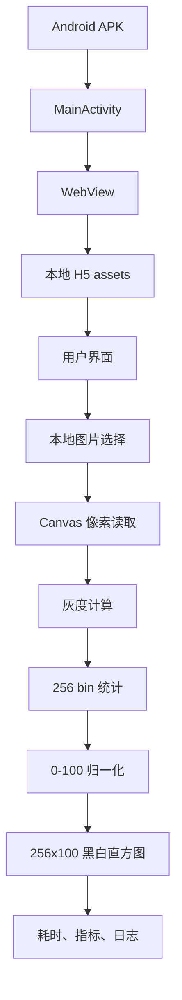

# 移动端图像直方图分析系统设计文档

## 1. 文档说明

本文档从需求分析师视角说明系统设计方案，重点回答“产品如何使用、模块如何协作、数据如何流动、验收点如何落到界面和流程上”。更底层的代码实现细节以 `docs/研发人员/tech-design.md` 为准。

## 2. 设计目标

系统设计围绕课程验收主线展开：

```text
用户选择本地图片
-> 系统预览图片
-> 读取像素并计算灰度直方图
-> 绘制 256x100 黑白结果
-> 显示耗时和指标
```

设计时优先保证正确、稳定、离线可演示。视觉和对比功能作为答辩增强，不改变核心算法。

## 3. 设计原则

| 原则 | 说明 |
| --- | --- |
| 主流程优先 | 任何增强功能都不能影响选图、计算、绘制、耗时展示 |
| 本地闭环 | 图片不上传，页面不依赖远程资源 |
| 结果真实 | 直方图必须来自真实像素统计，不使用示意图替代 |
| 口径统一 | 需求、设计、测试和答辩都使用同一套公式和尺寸说明 |
| 便于讲解 | 页面拆分成接入、链路、输出、指标、协议、日志，便于答辩逐步说明 |

## 4. 总体架构



架构分为两层：

| 层级 | 职责 | 主要文件 |
| --- | --- | --- |
| Android 壳层 | APK 启动、WebView 初始化、本地资源加载、系统文件选择、保存图片能力 | `app/src/main/java/com/framia/mobilehistogram/MainActivity.java` |
| H5 Canvas 层 | 页面交互、图片预览、像素读取、灰度统计、归一化、绘制、指标展示 | `app/src/main/assets/index.html`、`app/src/main/assets/app.js`、`app/src/main/assets/style.css` |

## 5. 功能模块设计

| 模块 | 输入 | 处理 | 输出 |
| --- | --- | --- | --- |
| 应用启动模块 | 用户点击 App 图标 | Android 启动 MainActivity 并加载本地页面 | H5 主界面 |
| 图片接入模块 | 用户选择图片 | WebView 文件选择回调，H5 接收文件 | 图片对象 |
| 预览模块 | 图片对象 | 页面展示图片 | 原图预览 |
| 像素读取模块 | 图片对象 | 绘制到隐藏 Canvas，调用 `getImageData` | RGBA 像素数据 |
| 灰度统计模块 | RGBA 数据 | 按公式计算 gray，写入 256 个 bin | `bins` |
| 归一化模块 | `bins` | 以最大 bin 为基准缩放到 `0-100` | `normalized` |
| 绘制模块 | `normalized` | Canvas 逐列绘制黑白柱 | `256x100` 直方图 |
| 指标模块 | bins、耗时、图片尺寸 | 计算像素总数、最大计数、性能余量 | 指标展示 |
| 对照模块 | baseline/optimized 数据 | 对比耗时和结果一致性 | 答辩说明 |

## 6. 页面设计

当前页面采用答辩友好的多视图结构。每个视图承担一个明确讲解任务。

| 页面 | 主要内容 | 设计目的 |
| --- | --- | --- |
| 接入 | 图片选择、原图预览、处理状态 | 让用户完成输入，并确认当前图片 |
| 链路 | Android Shell、H5 Canvas、Algorithm Core、Result Layer 架构说明 | 解释系统如何工作 |
| 输出 | `256x100` 直方图、Histogram Compare | 展示最终结果和对比能力 |
| 指标 | bins、像素总数、最大计数、耗时、性能余量 | 支撑验收和答辩说明 |
| 协议 | 公式、通道、归一化和输出规则 | 避免算法口径被误解 |
| 日志 | 处理流程日志 | 展示处理过程和状态反馈 |

页面不是营销式首页，打开后直接进入可操作的应用界面，符合课程验收的现场演示需求。

## 7. 核心流程设计

### 7.1 正常流程

```text
S01 打开 APK
S02 WebView 加载本地 index.html
S03 用户点击接入图像
S04 系统文件选择器返回图片
S05 页面展示原图预览
S06 Canvas 读取 RGBA 像素
S07 遍历像素并计算灰度值
S08 统计 256 个灰度 bin
S09 按最大计数归一化到 0-100
S10 绘制 256x100 黑白直方图
S11 展示耗时、指标和日志
```

### 7.2 异常流程

| 场景 | 系统处理 |
| --- | --- |
| 用户取消选择 | 保持当前页面状态，不触发处理 |
| 选择非图片文件 | 给出提示，允许重新选择 |
| 图片解码失败 | 提示读取失败 |
| Canvas 读取失败 | 提示处理失败，不展示伪造结果 |
| 保存图片失败 | 提示保存失败，不影响直方图主流程 |

## 8. 数据流设计

```text
File
-> HTMLImageElement
-> sourceCanvas
-> ImageData(RGBA)
-> bins[256]
-> normalized[256]
-> histogramCanvas(256x100)
-> 指标与日志
```

关键数据说明：

| 数据 | 说明 | 约束 |
| --- | --- | --- |
| File | 用户选择的图片 | 应为本地图片 |
| ImageData | Canvas 读取的像素数据 | 每 4 个数表示一个像素 |
| gray | 单个像素灰度值 | 使用指定公式计算 |
| bins | 灰度计数数组 | 长度必须为 256 |
| normalized | 归一化高度数组 | 高度范围 `0-100` |
| elapsedMs | 生成耗时 | 覆盖完整处理链路 |

## 9. 算法设计

灰度公式固定为：

```text
gray = red * 0.299 + green * 0.587 + blue * 0.114
```

统计和归一化规则：

```text
grayBin = Math.round(gray)
bins[grayBin] += 1
maxCount = max(bins)
normalized[i] = bins[i] / maxCount * 100
```

绘制规则：

- 横轴固定为 256 个灰度值；
- 纵向固定为 100 像素；
- 白底黑柱，从底部向上绘制；
- 页面可放大展示，但源结果仍是 `256x100`。

## 10. 性能设计

性能设计关注的是同一计时边界下的实现策略差异。

| 设计点 | 当前方案 |
| --- | --- |
| 统计结构 | `Uint32Array(256)`，避免普通对象反复分配 |
| 遍历方式 | 单次遍历 RGBA 数据完成灰度计算和计数 |
| 归一化 | 先获得最大计数，再一次生成高度数组 |
| 绘制 | 固定 `256x100` 输出，避免按原图尺寸绘制结果 |
| 计时边界 | 覆盖像素读取、灰度计算、统计、归一化和渲染 |

baseline 页面只用于性能对照，不作为正式产品入口。正式演示优先使用 optimized APK。

## 11. 离线与隐私设计

| 设计点 | 说明 |
| --- | --- |
| 本地 assets | H5 页面、脚本和样式打包在 APK 内 |
| 本地图片处理 | 用户图片只在手机本地进入 Canvas 处理 |
| 无后端依赖 | 不引入服务器、数据库、登录或云存储 |
| 无远程资源 | 核心页面不依赖 CDN、远程脚本或远程图片 |
| 权限控制 | 图片选择优先走系统选择器，减少额外权限 |

## 12. 交付设计

| 产物 | 作用 |
| --- | --- |
| `mobile-histogram-optimized-coinstall-debug.apk` | 当前正式演示版本 |
| `mobile-histogram-baseline-coinstall-debug.apk` | 性能对照版本 |
| `stage5-performance-comparison.md` | benchmark 和可并装 APK 证据 |
| `stage4-apk-handoff.md` | APK 打包、包名、哈希和待回填项 |
| 自动化测试脚本 | 验证算法、离线和 baseline 一致性 |

## 13. 设计约束

- 不引入后端、数据库、登录和云上传。
- 不替换灰度公式。
- 不把美观图表当成真实统计结果。
- 不只统计绘制耗时来制造更好看的性能数据。
- 不让演示依赖网络环境。

## 14. 设计结论

本系统采用 Android WebView + H5 Canvas 的设计是合理的：Android 负责移动端交付和本地能力，H5 负责图像处理算法和展示。这个方案既能满足课程对移动端、离线、直方图、耗时展示的要求，也便于测试和答辩讲解。

当前设计已经覆盖主流程，后续工作应集中在测试报告、真机数据回填和答辩材料整理，不建议继续扩大系统范围。
