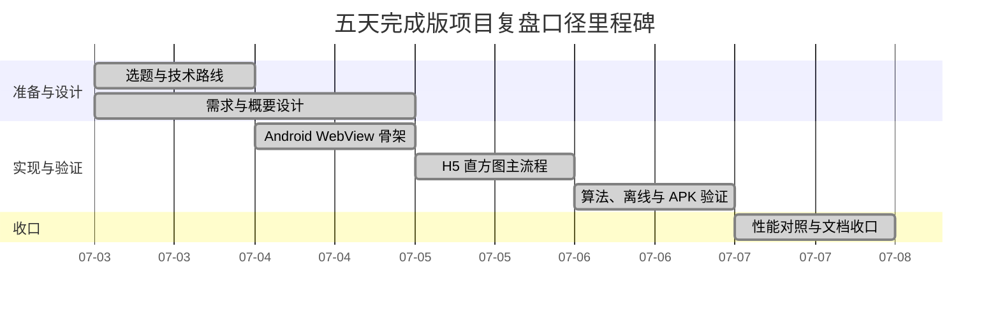

# 移动端图像直方图分析系统项目计划

## 1. 文档说明

本文档从项目经理视角整理“移动端图像直方图分析系统”的项目计划。由于项目功能已经基本完成，本文按仓库现有源码、测试记录和任务台账进行反向补齐，重点说明项目范围、里程碑、交付物、质量要求和收尾安排。

这不是重新规划一个新项目，而是把实际完成过程整理成课程交付可读的计划文件。涉及真机型号、Android 版本、最终演示截图等尚未回填的信息，在本文中保持为待补项，不写成已经完成。

## 2. 项目概况

| 项目项 | 内容 |
| --- | --- |
| 项目名称 | 移动端图像直方图分析系统 |
| 课程题目 | 图像直方图计算及性能优化 |
| 项目形态 | Android WebView 壳 App + H5 Canvas |
| 最终产物 | Android APK、源码、测试证据、课程文档、答辩材料 |
| 运行方式 | 安装 APK 后离线运行，本地选择图片并生成灰度直方图 |
| 核心约束 | 不依赖后端、数据库、云存储或网络资源 |
| 管理口径 | 主流程优先，性能对照单独固化，文档与证据同步收口 |

项目核心流程如下：

```text
安装并启动 APK
-> WebView 加载本地 H5 页面
-> 用户选择手机本地图片
-> 预览原图
-> Canvas 读取 RGBA 像素
-> 按指定公式计算灰度值
-> 统计 0-255 共 256 个灰度 bin
-> 归一化到 0-100
-> 绘制 256x100 黑白直方图
-> 展示生成耗时和辅助指标
```

## 3. 项目目标

### 3.1 交付目标

| 编号 | 目标 | 验收方式 |
| --- | --- | --- |
| G-01 | 完成可安装运行的 Android APK | `dist/` 中存在 debug APK，Android 工程可构建 |
| G-02 | 支持本地图片选择与预览 | WebView 文件选择回调和 H5 图片预览可用 |
| G-03 | 按课程公式生成灰度直方图 | 源码与算法测试均使用 `gray = red * 0.299 + green * 0.587 + blue * 0.114` |
| G-04 | 输出 `256x100` 黑白直方图 | Canvas 源尺寸和测试用例验证 |
| G-05 | 显示完整生成耗时 | 计时覆盖像素读取、灰度计算、统计、归一化和绘制 |
| G-06 | 形成性能优化说明 | baseline 与 optimized 对照实验、两份可并装 APK、benchmark 表格 |
| G-07 | 补齐课程交付文档 | 需求、概要设计、测试、使用说明、项目管理、答辩材料等文档成体系 |

### 3.2 管理目标

- 项目范围集中在课程要求的移动端图像直方图计算，不扩大为后台系统。
- 先保证“可安装、可选图、可计算、可展示、可解释”，再做视觉和性能证据增强。
- 文档中的功能描述必须能在源码、APK、测试记录或任务台账中找到依据。
- 答辩材料要能讲清三个问题：为什么这样设计、结果为什么正确、性能为什么能达标。

## 4. 项目范围

### 4.1 范围内

| 类别 | 内容 |
| --- | --- |
| 移动端交付 | Android APK、WebView 容器、本地 H5 assets 加载 |
| 图像输入 | 手机本地图片选择，支持常见图片格式 |
| 图像处理 | Canvas 读取像素、灰度计算、256 bin 统计、0-100 归一化 |
| 结果展示 | 原图预览、`256x100` 黑白直方图、生成耗时、核心指标 |
| 性能说明 | 优化前/优化后对照、benchmark、同边界计时说明 |
| 测试验证 | 算法 fixture、离线资源检查、baseline 一致性检查、APK 打包证据 |
| 课程文档 | 选题、需求、概要设计、技术设计、测试记录、项目管理、答辩材料 |

### 4.2 范围外

| 不做的内容 | 原因 |
| --- | --- |
| 用户登录、账号体系 | 与课程核心验收无直接关系，会增加非必要复杂度 |
| 后端接口、数据库、云存储 | 项目目标是离线本地处理，图片不上传服务器 |
| 图片云端分享或同步 | 不属于直方图计算主流程 |
| 远程部署平台 | 最终交付形态是 APK，不是 Web 服务 |
| 改用其他灰度公式 | 课程明确要求指定公式，不能为了效果更好而替换 |
| 伪造装饰性图表 | 直方图必须来自真实 256 bin 统计数据 |

### 4.3 可选增强

以下内容已经部分实现或可作为答辩亮点，但不替代核心验收要求：

- 优化前和优化后两份可并装 APK。
- Histogram Compare 对比展示。
- 直方图点击横屏放大。
- 长按保存“原图 + 说明 + 直方图”拼接图。
- 答辩友好的多 tab 控制台界面。

## 5. 组织分工

本项目规模不大，实际执行上更接近短周期课程小组项目。分工采用“一人可兼多岗，但交付物按角色归口”的方式管理。

| 角色 | 主要职责 | 关键产物 |
| --- | --- | --- |
| 项目经理 | 明确范围、拆分里程碑、跟踪进度、识别风险、组织收尾 | 项目计划、进度跟踪表、风险识别表、最终检查清单 |
| 需求与文档负责人 | 整理选题、需求、概要设计、使用说明和答辩文字 | 需求分析、概要设计、课程文档 |
| Android 研发 | 负责 APK、WebView、文件选择、资源打包、系统保存能力 | `MainActivity.java`、Manifest、APK |
| H5 与算法研发 | 负责页面、Canvas、灰度计算、统计、归一化和绘制 | `index.html`、`app.js`、`style.css` |
| 测试负责人 | 负责算法测试、离线验证、性能对照、APK 验证记录 | 测试脚本、测试报告、性能对照记录 |
| 答辩负责人 | 负责演示路径、PPT、讲解口径和现场问题准备 | 演示脚本、答辩材料、截图证据 |

## 6. 工作分解

| 阶段 | 工作包 | 主要内容 | 输出 |
| --- | --- | --- | --- |
| P0 项目准备 | 选题与路线 | 明确课程题目、技术路线、范围边界 | 选题报告、README 初版 |
| P1 需求与设计 | 需求、概要、技术方案 | 梳理功能需求、非功能需求、模块边界、主流程 | 需求分析、概要设计、技术设计 |
| P2 主流程实现 | APK 与 H5 闭环 | Android 壳、WebView、本地页面、图片选择、直方图算法 | 可运行 APK、核心源码 |
| P3 测试验证 | 算法与离线验证 | fixture 测试、离线 assets 检查、主流程证据 | 测试脚本、阶段测试记录 |
| P4 性能与体验收口 | 对照实验与 UI 收口 | baseline/optimized 对照、loading、架构图、图标、对比展示 | 两份可并装 APK、性能对照文档 |
| P5 课程材料收尾 | 文档反补与答辩准备 | 项目管理文档、测试报告、使用说明、PPT 和演示脚本 | 最终文档包、答辩材料 |

## 7. 里程碑计划

| 里程碑 | 计划完成点 | 目标 | 当前结果 | 证据位置 |
| --- | --- | --- | --- | --- |
| M1 选题确认 | 项目第 1 天 | 锁定“图像直方图计算及性能优化”，确认 Android APK 路线 | 已完成 | `docs/产物-项目选题报告.md` |
| M2 需求与概要设计完成 | 项目第 1-2 天 | 明确功能范围、非功能要求、主流程和模块边界 | 已完成 | `docs/产物-需求分析报告.md`、`docs/产物-概要设计.md` |
| M3 Android WebView 骨架完成 | 项目第 2 天 | APK 可构建，WebView 可加载本地 H5 | 已完成 | `docs/测试人员/stage1-apk-build-evidence.md` |
| M4 直方图主流程完成 | 项目第 3 天 | 选图、预览、灰度统计、归一化、绘制、耗时展示跑通 | 已完成 | `docs/测试人员/stage2-histogram-main-flow-evidence.md` |
| M5 算法、离线与 APK 验证完成 | 项目第 4 天 | 算法 fixture、离线 assets 检查和 APK 打包证据完成 | 已完成，真机细节待回填 | `docs/测试人员/stage3-algorithm-offline-self-test.md`、`docs/测试人员/stage4-apk-handoff.md` |
| M6 性能对照与课程文档收口 | 项目第 5 天 | 输出优化前/优化后可并装 APK，完成同边界性能对比，并补齐项目管理类文档 | 已完成，最终真机数据和答辩材料可继续增强 | `docs/测试人员/stage5-performance-comparison.md`、`docs/项目经理/` |



## 8. 质量计划

### 8.1 功能质量

| 检查项 | 通过标准 |
| --- | --- |
| 图片选择 | 在 Android WebView 中能够调起本地图片选择入口 |
| 图片预览 | 选图后能够展示当前图片，便于确认处理对象 |
| 灰度公式 | 源码和测试均使用课程指定公式 |
| bin 数量 | 统计数组固定为 256 个灰度值 |
| 归一化 | 高度范围为 `0-100`，最大 bin 对应 100 |
| 绘制尺寸 | 源直方图为 `256x100` 黑白图 |
| 耗时显示 | 耗时覆盖完整处理链路，而不是只统计绘制动作 |

### 8.2 验证命令

项目收尾前至少执行：

```bash
npm run test:histogram
npm run test:offline
npm run test:baseline
npm run benchmark:histogram
npm run check:source-comments
npm run harness:verify
```

如重新打包 APK，还需要执行 Android 构建命令，并更新 APK 大小、SHA256、包名和入口检查记录。

### 8.3 文档质量

- 文档名称、功能描述和 README 保持一致。
- 不把待回填真机数据写成已验证结论。
- 性能数据注明测试环境，开发机 benchmark 不替代手机实测。
- 范围外内容明确写出，不在答辩中临时扩口。
- 最终提交前检查文档之间是否存在路径、术语和状态不一致。

## 9. 沟通与变更管理

| 场景 | 处理方式 |
| --- | --- |
| 功能实现完成 | 更新任务台账和阶段证据 |
| 发现缺失文档 | 新增任务或在已有课程交付任务中补充说明 |
| 用户反馈真机问题 | 先记录现象、机型、系统版本和截图，再判断是否修改源码或重打包 |
| 范围变更 | 先判断是否服务课程验收，后端、数据库、云上传默认不纳入本期 |
| 答辩材料修改 | 以已实现功能和已有证据为准，避免临场扩展不可演示内容 |

变更原则：

1. 不改动课程硬性要求：灰度公式、256 bin、`256x100`、耗时展示、离线 APK。
2. 不为了视觉效果牺牲结果真实性。
3. 新增功能必须能解释其与验收或答辩的关系。
4. 影响 APK 的变更需要重新打包并更新证据。
5. 影响文档口径的变更需要同步 README、任务台账或测试记录。

## 10. 收尾标准

| 收尾项 | 标准 | 当前状态 |
| --- | --- | --- |
| APK 产物 | `dist/` 中有可安装 APK，包名和入口清楚 | 已完成 |
| 核心功能 | 选图、预览、计算、绘制、耗时展示可演示 | 已完成 |
| 算法测试 | 灰度公式、256 bin、归一化、绘制规则有脚本验证 | 已完成 |
| 性能证据 | 有 baseline/optimized 同边界对照和说明 | 已完成，真机数据可继续补充 |
| 项目管理文档 | 项目计划、进度跟踪、风险识别表齐全 | 本次补齐 |
| 测试报告 | 汇总测试计划、用例、执行结果和结论 | 待单独整理 |
| 使用说明 | APK 安装、选图、查看结果、注意事项清楚 | 待单独整理 |
| 答辩材料 | PPT、演示脚本、问答准备齐全 | 待单独整理 |

## 11. 项目经理结论

从项目管理角度看，本项目的主交付路线是正确的：没有把精力分散到后端、登录、数据库等非核心范围，而是围绕课程题目把移动端 APK、H5 Canvas 算法、离线运行、性能对照和答辩展示串成了闭环。

当前项目功能侧已经具备交付条件，收尾重点不再是继续加功能，而是把测试报告、使用说明、答辩材料和真机回填证据整理完整。只要后续文档继续坚持“已有证据再写结论”的原则，最终提交材料会比较稳。
